# tensorflow圖形檢測_使用Google Colab使用Tensorflow進行自定義對象檢測 
摘要:本文介紹如何TensorFlow對象檢測API創建自定義對象檢測器。詳細步驟包括安裝設置、數據收集、圖像標註、生成TF 
Record等，並提供了訓練配置及測試流程。 
 
在此文章中，我們將使用 Tensorflow 物件偵測 (Object Detection) API 來建立自定義的物件偵測器。我將選擇偵測蘋果果實，但是您可以選擇要偵測自己的自定義對象的任何圖像。 

步驟： 
安裝 (Installation) 
收集資料 (Gathering data) 
標註資料 (Labeling data) 
生成 TFRecords 以供訓練 (Generating TFRecords for training) 
配置訓練 (Configuring training) 
訓練模型 (Training model) 
匯出推論圖 (Exporting inference graph) 
測試物件偵測器 (Testing object detector) 
一、安裝 (Installation) 
1.Python 3.6 或更高版本。 
2.Ubuntu 18.04 / Google Colab。 
3.Tensorflow / Tensorflow-gpu。 
4.克隆 Tensorflow 模型儲存庫。 
 
1. 檢查環境 

Protobuf 編譯：TensorFlow 物件偵測 API 使用 Protobufs 來配置模型與訓練參數。在使用該框架之前，必須先編譯 Protobuf 檔案。 
這可以透過從 tensorflow/models/research/ 目錄運行以下命令來完成： 
 
將系統路徑加入 PYTHONPATH 
在 Google Colab 上運行時，應將 Tfmodels/research 和 slim 目錄新增到 PYTHONPATH。 
Object Detection Installation（安裝物件偵測） 
Testing the Installation（測試安裝） 
使用 Google Colab 的範例可參閱下方連結： 
使用 Google Colab 訓練 Tensorflow 物件偵測 API 
 
二、資料收集（Gathering data） 
2.1 
打開 Google Chrome 瀏覽器，搜尋並安裝一個名為 Download All Images 的瀏覽器擴充套件。 
 
2.2 
現在在 Google 上輸入並搜尋你想要的對象，例如「Apple」，點擊「下載所有圖像」的擴充套件按鈕。這樣就能批次下載圖片，通常會自動儲存為一個 .zip 壓縮檔。 
 
三、資料標註（Labeling data） 
打開終端機並輸入以下方式安裝 LabelImg 
LabelImg 是用於影像標註的工具。 
安裝 LabelImg 後，透過這個指令來啟動： 
 
在不同的環境中安裝 LabelImg 的方法可能不同，可以參考以下網站： 
👉 https://github.com/tzutalin/labelImg 
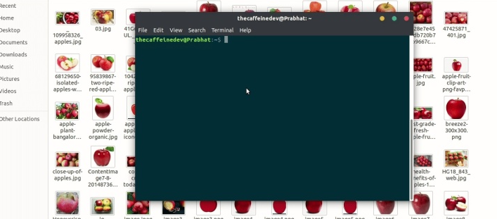 
上面的內容並非所有圖片均完成標註，它正在進行中。 
LabelImg 在每張圖像旁會生成一個 XML 文件，裡面包含了物件名稱與邊界框的座標資訊。 
這裡大約有 100 張圖片。 
現在需要克隆儲存庫： 
👉 https://github.com/zjgulai/Tensorflow-Object-Detection-API-With-Custom-Dataset 
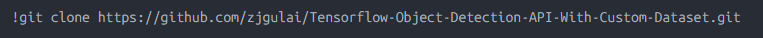 
克隆之後進入目錄: 
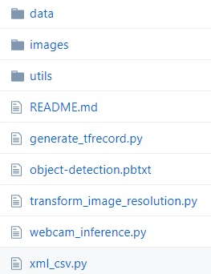 
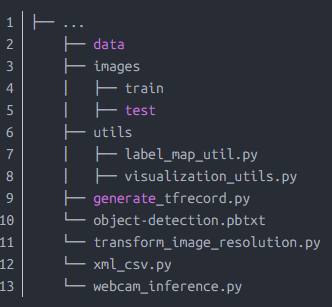 
四、Generating TFRecords for training 
現在,將圖像檔案的70%複製到訓練資料夾圖像/訓練中,其餘30%複製到測試資料夾中。 
在標記了影像的情況下,我們需要建立TFRecords用作輸入資料以訓練物件偵測器。為了創建TFRecords,我們將使用 
datitran/raccoon_datasetgithub.com 
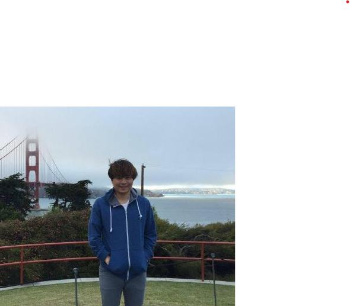 
兩個腳本。即xml_to_csv.py和generate_tfrecord.py檔。 
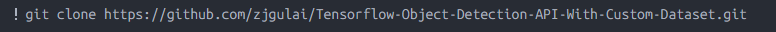 
目錄: 
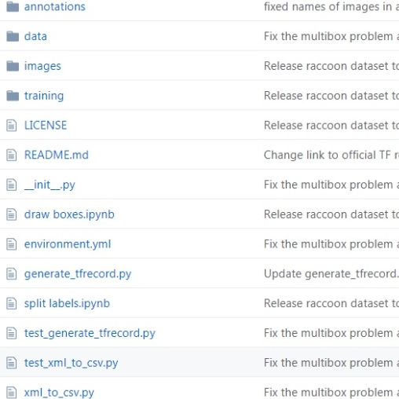 
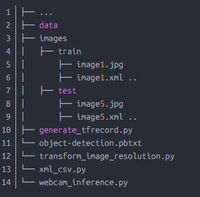 
現在在該資料夾中,我們可以透過開啟命令列並鍵入以下內容,將XML檔案轉換為訓練標籤.csv和test_label.csv: 
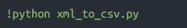 
它們在資料目錄中會建立兩個檔案。一個叫做test_labels.csv,另一個叫做train_labels.csv. 
在將新建立的檔案轉換為TFRecords之前,我們需要更改generate_tfrecords.py檔案中的幾行。 
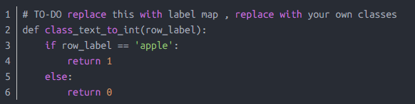 
如你有多類標記: 
 
現在,您可以透過鍵入以下內容來產生TFRecords: 
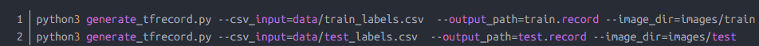 
這兩個指令產生一個train.record和一個test.record檔,可用來訓練我們的物件偵測器。 
五、Configuring training 
訓練之前，我們要做的最後一件事是create a label map and a training configuration file. 
六、Creating a label map 
The label map maps: an id to a name. 
I have already created a label map file for my training. It looks like this: 
編輯: object-detection.pbtxt 
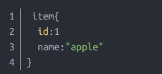 
如果您使用多個類，清尊循此模式 
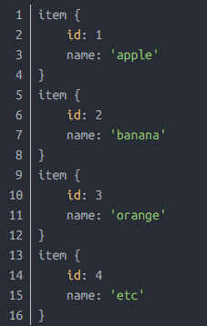 
每個類別的ID號碼應與generate_tfrecord.py檔案中指定的ID相符。 
七、Creating a training configuration 
我們將在Google Colab中訓練我們的模型。 
I am using "SSD_MOBILENET_V2" for training and with the batch size of 4. 
You can change the number of steps, which pre-trained model to use & the batch and size. 
然後,您需要運行以下單元格。將會有一個Upload TF Record提示。 
在此之下,您需要上傳生成的 
1. train.record 
2. test.record 
3. object-detection.pbtxt 
八、Training model 
現在,在上傳所有這些文件之後,運行下面的所有單元格，它將得到訓練。 
九、Exporting inference graph 
如果已執行所有單元,則最後將下載一個名為Frozen_inference_graph.pb的檔案。 
十、Testing Object Detector 
現在,將Frozen_inference_graph.pb檔案複製到我的GitHub克隆資料夾中。然後,您需要在該webcam_inference.py中進行一些編輯,以測試您自己的物件偵測器。打開該文件並檢查代碼。 
如果您正確執行了上述所有步驟,則可以透過網路攝影機測試模型。 
十一、Conclusion 
Tensorflow物件偵測API可讓您使用轉移學習技術建立自己的物件偵測器。 
代碼連結: 
https://github.com/zjgulai/Tensorflow-Object-Detection-API-With-Custom-Datasetgithub.com 
參考文獻和連結: 
1. https://github.com/tensorflow/models/tree/master/research/object_detection 
2. https://medium.com/@WuStangDan/step-by-step-tensorflow-object-detection-api-tutorial-part-1-selecting-a-model-a02b6aabe39e 
3. https://pythonprogramming.net/introduction-use-tensorflow-object-detection-api-tutorial/ 
4. https://towardsdatascience.com/creating-your-own-object-detector-ad69dda69c85 
https://medium.com/analytics-vidhya/custom-object-detection-with-tensorflow-using-google-colab-7cbc484f83d7 
http://weixin.qq.com/r/5TqGnkTEZhkZrQD992-3(二維碼自動辨識) 

