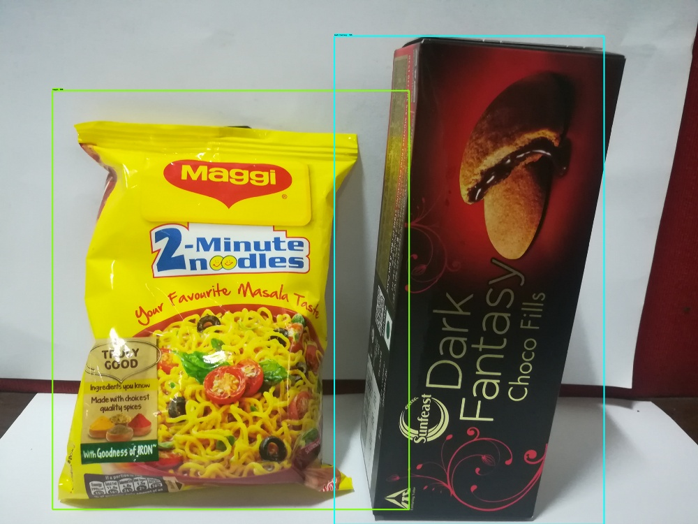
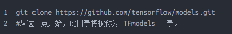
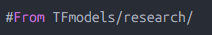
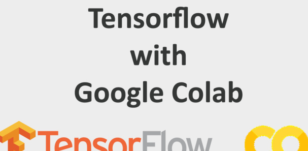
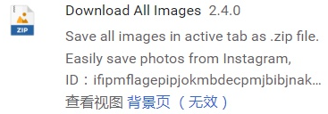
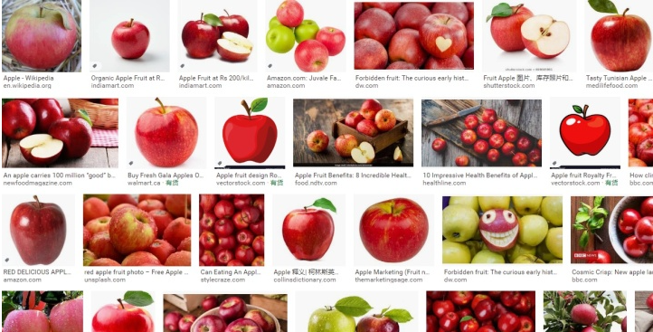
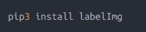

# tensorflow圖形檢測_使用Google Colab使用Tensorflow進行自定義對象檢測 

在此文章中，我們將使用 Tensorflow 物件偵測 (Object Detection) API 來建立自定義的物件偵測器。我將選擇偵測蘋果果實，但是您可以選擇要偵測自己的自定義對象的任何圖像。 

步驟： 
安裝 (Installation) 
收集資料 (Gathering data) 
標註資料 (Labeling data) 
生成 TFRecords 以供訓練 (Generating TFRecords for training) 
配置訓練 (Configuring training) 
訓練模型 (Training model) 
匯出推論圖 (Exporting inference graph) 
測試物件偵測器 (Testing object detector) 
一、安裝 (Installation) 
1.Python 3.6 或更高版本。 
2.Ubuntu 18.04 / Google Colab。 
3.Tensorflow / Tensorflow-gpu。 
4.克隆 Tensorflow 模型儲存庫。 
 
1. 檢查環境 

Protobuf 編譯：TensorFlow 物件偵測 API 使用 Protobufs 來配置模型與訓練參數。在使用該框架之前，必須先編譯 Protobuf 檔案。 
這可以透過從 tensorflow/models/research/ 目錄運行以下命令來完成： 
 
將系統路徑加入 PYTHONPATH 
在 Google Colab 上運行時，應將 Tfmodels/research 和 slim 目錄新增到 PYTHONPATH。 
Object Detection Installation（安裝物件偵測） 
Testing the Installation（測試安裝） 
使用 Google Colab 的範例可參閱下方連結： 
使用 Google Colab 訓練 Tensorflow 物件偵測 API 
 
二、資料收集（Gathering data） 
2.1 
打開 Google Chrome 瀏覽器，搜尋並安裝一個名為 Download All Images 的瀏覽器擴充套件。 
 
2.2 
現在在 Google 上輸入並搜尋你想要的對象，例如「Apple」，點擊「下載所有圖像」的擴充套件按鈕。這樣就能批次下載圖片，通常會自動儲存為一個 .zip 壓縮檔。 
 
三、資料標註（Labeling data） 
打開終端機並輸入以下方式安裝 LabelImg 
LabelImg 是用於影像標註的工具。 
安裝 LabelImg 後，透過這個指令來啟動： 
 
在不同的環境中安裝 LabelImg 的方法可能不同，可以參考以下網站： 
👉 https://github.com/tzutalin/labelImg 
上面的內容並非所有圖片均完成標註，它正在進行中。 
LabelImg 在每張圖像旁會生成一個 XML 文件，裡面包含了物件名稱與邊界框的座標資訊。 
這裡大約有 100 張圖片。 
現在需要克隆儲存庫： 
👉 https://github.com/zjgulai/Tensorflow-Object-Detection-API-With-Custom-Dataset 

使用以下命令克隆： 
完成後進入該目錄即可進行後續操作。 

